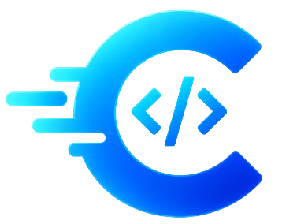
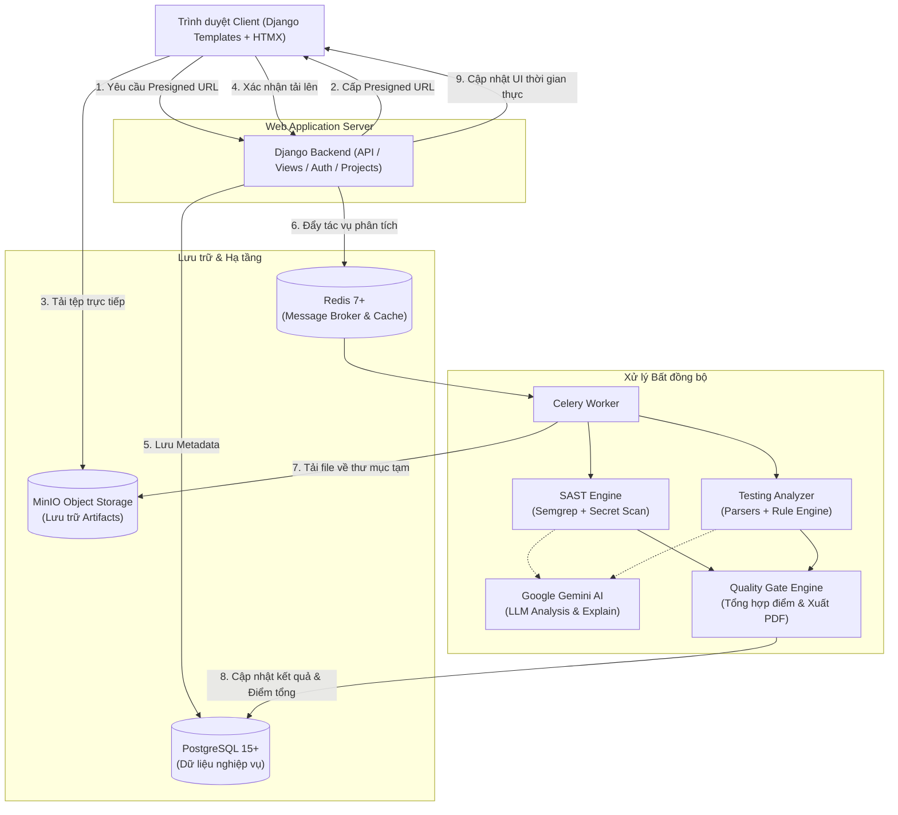

<div align="center">



# Checkease

### 🚀 Nền tảng Đánh giá Tính sẵn sàng Phát hành Phần mềm & Cổng Kiểm định Chất lượng Tự động
*(Automated Release Readiness & Quality Gate Platform)*

[](https://www.python.org/)
[](https://www.djangoproject.com/)
[](https://www.postgresql.org/)
[](https://docs.celeryq.dev/)
[](https://redis.io/)
[](https://min.io/)
[](https://semgrep.dev/)
[](https://ai.google.dev/)
[](https://www.docker.com/)

<p align="center">
  <b>Giải pháp tự động hóa toàn diện giúp đội ngũ kỹ thuật đánh giá chất lượng mã nguồn, phát hiện lỗ hổng bảo mật, phân tích tài liệu kiểm thử và đưa ra quyết định phát hành phần mềm chính xác, minh bạch.</b>
</p>

[Tính năng](#-tính-năng-nổi-bật) • [Kiến trúc](#-kiến-trúc-hệ-thống) • [Cài đặt nhanh (Docker)](#-cách-1-khởi-chạy-nhanh-với-docker-compose-khuyên-dùng) • [Cài đặt Local](#-cách-2-khởi-chạy-thủ-công-local-development) • [Biến môi trường](#-cấu-hình-biến-môi-trường-env) • [Quy trình sử dụng](#-quy-trình-sử-dụng-cơ-bản)

---

</div>

## 📖 Mục lục

- [Giới thiệu tổng quan](#-giới-thiệu-tổng-quan)
- [Tính năng nổi bật](#-tính-năng-nổi-bật)
- [Kiến trúc hệ thống](#-kiến-trúc-hệ-thống)
- [Yêu cầu hệ thống](#-yêu-cầu-hệ-thống)
- [Hướng dẫn khởi chạy](#-hướng-dẫn-khởi-chạy)
  - [Cách 1: Khởi chạy nhanh với Docker Compose (Khuyên dùng)](#-cách-1-khởi-chạy-nhanh-với-docker-compose-khuyên-dùng)
  - [Cách 2: Khởi chạy thủ công (Local Development)](#-cách-2-khởi-chạy-thủ-công-local-development)
- [Cấu hình MinIO Object Storage](#-cấu-hình-minio-object-storage)
- [Cấu hình biến môi trường (.env)](#-cấu-hình-biến-môi-trường-env)
- [Quy trình sử dụng cơ bản](#-quy-trình-sử-dụng-cơ-bản)
- [Cấu trúc thư mục dự án](#-cấu-trúc-thư-mục-dự-án)
- [Cơ chế an toàn & Bảo mật](#-cơ-chế-an-toàn--bảo-mật)
- [Xử lý sự cố thường gặp (Troubleshooting)](#-xử-lý-sự-cố-thường-gặp-troubleshooting)

---

## 💡 Giới thiệu tổng quan

Trong chu trình phát triển phần mềm hiện đại, việc đánh giá xem một phiên bản ứng dụng có đủ điều kiện để triển khai lên môi trường sản phẩm (Production) hay không thường gặp nhiều rào cản:
- Đánh giá thủ công, thiếu tính nhất quán và tốn nhiều nhân lực.
- Lỗ hổng bảo mật hoặc rò rỉ secret key chỉ được phát hiện muộn.
- Báo cáo kiểm thử nằm rải rác ở nhiều định dạng (Excel, Word, PDF) khó tổng hợp.

**Checkease** giải quyết triệt để vấn đề này bằng cách cung cấp một nền tảng **Quality Gate tập trung**:
1. Tiếp nhận và lưu trữ an toàn mã nguồn (`.zip`) và tài liệu kiểm thử (`.xlsx`, `.docx`, `.pdf`).
2. Tự động quét kiểm định bảo mật tĩnh (**SAST - Static Application Security Testing**) và rò rỉ secrets.
3. Bóc tách và phân tích ngữ nghĩa kết quả kiểm thử (Test Cases, Pass Rate, Defect Density).
4. Sử dụng mô hình **Google Gemini AI** nhằm giải thích lỗ hổng, phân tích lỗi ngữ nghĩa và đưa ra khuyến nghị khắc phục chi tiết.
5. Tổng hợp điểm số qua **Gate Engine** theo trọng số tùy chỉnh của từng dự án để đưa ra phán quyết phát hành: **PASSED (Đạt)**, **WARNING (Cảnh báo)** hoặc **FAILED (Từ chối phát hành)**.
6. Cho phép xuất báo cáo đánh giá toàn diện dưới định dạng **PDF**.

---

## ✨ Tính năng nổi bật

### 1. 🛡️ Quét tĩnh mã nguồn & Phát hiện Secret (SAST & Secret Scanning)
- Tích hợp công cụ phân tích tĩnh chuẩn công nghiệp **Semgrep** với bộ quy tắc tùy biến.
- Quét và phát hiện các mẫu rò rỉ khóa bí mật, API token, mật khẩu cứng (Hardcoded Secrets).
- Tự động phát hiện các vi phạm nghiêm trọng (**Hard Gates**) để khóa quyết định phát hành ngay lập tức nếu có rủi ro chí mạng.

### 2. 📑 Phân tích tài liệu kiểm thử thông minh (Test Artifact Analysis)
- Đọc và trích xuất dữ liệu tự động từ các file tài liệu kiểm thử phổ biến: **Excel (.xlsx)**, **Word (.docx)** và **PDF**.
- Phân loại lỗi và ca kiểm thử tự động bằng bộ quy tắc thông minh (Rule-based Analyzer).

### 3. 🤖 Trợ lý AI đồng hành (Google Gemini AI Integration)
- **AI Explainer**: Tự động giải thích nguyên nhân gốc rễ (Root Cause) của lỗ hổng bảo mật và cung cấp đoạn mã mẫu khắc phục (Remediation Code).
- **AI Semantic Analyzer**: Phân tích lỗi kiểm thử phức tạp không cấu trúc và sinh báo cáo tóm tắt điều hành (**Executive Summary**).

### 4. ⚖️ Động cơ cổng chất lượng tùy biến (Quality Gate Engine)
- Thiết lập trọng số linh hoạt giữa chất lượng mã nguồn (`source_code_weight`) và chất lượng kiểm thử (`testing_weight`).
- Thiết lập ngưỡng đỗ (`pass_threshold`) và ngưỡng cảnh báo (`warning_threshold`) riêng biệt cho từng dự án.
- Tự động tính toán điểm tổng hợp ngay khi các tác vụ xử lý nền hoàn tất.

### 5. 🔒 Lưu trữ & Tải lên tệp an toàn (Safe Upload & Object Storage)
- Cơ chế **Presigned URL**: Tải file trực tiếp từ trình duyệt lên MinIO (S3-compatible) mà không làm tắc nghẽn Django backend.
- Cơ chế phòng vệ chống tấn công giải nén mã độc (**Zip Slip**, **Zip Bomb** / Billion Laughs).
- Xác thực toàn vẹn bằng hàm băm mật mã học **SHA-256** và cơ chế loại trừ trùng lặp (Deduplication).

### 6. ⚡ Giao diện hiện đại, mượt mà (Server-Driven UI)
- Xây dựng bằng **Django Templates + HTMX**, phản hồi tức thì mà không cần cài đặt các framework SPA (React/Vue) cồng kềnh.
- Hệ thống Design System đồng bộ với CSS Tokens chuẩn.

---

## 🏗️ Kiến trúc hệ thống

Dự án được xây dựng theo mô hình **Modular Monolith** kết hợp kiến trúc hướng sự kiện bất đồng bộ:



---

## 📋 Yêu cầu hệ thống

Trước khi bắt đầu, hãy đảm bảo máy tính của bạn đã cài đặt các công cụ sau:

- **Git** (để clone mã nguồn): [Tải Git](https://git-scm.com/)
- **Docker & Docker Compose** *(Khuyên dùng)*: [Tải Docker Desktop](https://www.docker.com/products/docker-desktop/)
- **Python 3.10 hoặc mới hơn** *(Nếu chọn chạy thủ công)*: [Tải Python](https://www.python.org/downloads/)

---

## 🚀 Hướng dẫn khởi chạy

### 🐳 Cách 1: Khởi chạy nhanh với Docker Compose *(Khuyên dùng)*

Đây là phương thức đơn giản và đồng bộ nhất, đóng gói toàn bộ: Django Web, Celery Worker, PostgreSQL, Redis và MinIO.

#### Bước 1: Clone kho mã nguồn về máy
```bash
git clone https://github.com/DangKien28/checkease.git
cd checkease
```

#### Bước 2: Tạo file cấu hình môi trường (.env)
Sao chép từ file mẫu:
```bash
# Trên Linux / macOS:
cp .env.example .env

# Trên Windows (PowerShell):
Copy-Item .env.example .env

# Trên Windows (Command Prompt):
copy .env.example .env
```

> [!NOTE]
> Mở file `.env` vừa tạo và kiểm tra:
> - Khi chạy với Docker Compose, `POSTGRES_HOST=db`, `CELERY_BROKER_URL=redis://redis:6379/0`, `MINIO_ENDPOINT=http://minio:9000`.
> - Điền `GEMINI_API_KEY` nếu bạn muốn trải nghiệm phân tích AI tự động.

#### Bước 3: Khởi chạy các container
```bash
docker compose up -d --build
```
Kiểm tra trạng thái các container đang chạy:
```bash
docker compose ps
```

#### Bước 4: Chạy Migration và Tạo tài khoản quản trị (Superuser)
```bash
# Áp dụng các thay đổi database
docker compose exec web python manage.py migrate

# Tạo tài khoản quản trị viên (Admin)
docker compose exec web python manage.py createsuperuser
```
*(Nhập Email và Mật khẩu theo hướng dẫn trên terminal)*

#### Bước 5: Tạo Bucket trên MinIO
Để hệ thống có thể nhận file tải lên, bạn cần tạo bucket `artifact` trên MinIO:
1. Mở trình duyệt và truy cập MinIO Console: **[http://localhost:9001](http://localhost:9001)**
2. Đăng nhập với tài khoản:
   - **Username:** `minioadmin` *(hoặc giá trị MINIO_ROOT_USER trong file .env)*
   - **Password:** `minioadmin_secret` *(hoặc giá trị MINIO_ROOT_PASSWORD trong file .env)*
3. Vào mục **Administrator** -> **Buckets** -> Nhấn nút **Create Bucket**.
4. Đặt tên Bucket là: `artifact` rồi nhấn **Create Bucket**.

🎉 **Hoàn tất!** Hãy truy cập ngay **[http://localhost:8000](http://localhost:8000)** để sử dụng ứng dụng.

---

### 💻 Cách 2: Khởi chạy thủ công (Local Development)

Nếu bạn muốn debug trực tiếp hoặc phát triển thêm tính năng mà không cần build lại Docker image mỗi lần chỉnh sửa:

#### Bước 1: Khởi chạy các dịch vụ bổ trợ bằng Docker
Chạy riêng PostgreSQL, Redis và MinIO trên Docker:
```bash
docker compose up -d db redis minio
```

#### Bước 2: Thiết lập môi trường ảo Python
```bash
# Tạo môi trường ảo
python -m venv venv

# Kích hoạt môi trường ảo:
# Trên Windows (PowerShell):
.\venv\Scripts\Activate.ps1
# Trên Windows (CMD):
.\venv\Scripts\activate.bat
# Trên Linux/macOS:
source venv/bin/activate

# Nâng cấp pip và cài đặt dependencies
pip install --upgrade pip
pip install -r requirements.txt
```

#### Bước 3: Cấu hình file `.env` cho Local Dev
Sao chép `.env.example` thành `.env` và điều chỉnh các biến kết nối về `localhost`:
```ini
DJANGO_SECRET_KEY=django-insecure-local-dev-key-random-string

POSTGRES_DB=checkease_db
POSTGRES_USER=postgres
POSTGRES_PASSWORD=your_secure_password_here
POSTGRES_PORT=5432
POSTGRES_HOST=localhost

REDIS_HOST=localhost
CELERY_BROKER_URL=redis://127.0.0.1:6379/0
CELERY_RESULT_BACKEND=redis://127.0.0.1:6379/0

MINIO_ROOT_USER=minioadmin
MINIO_ROOT_PASSWORD=minioadmin_secret
MINIO_BUCKET_NAME=artifact
MINIO_ENDPOINT=http://localhost:9000
MINIO_PUBLIC_ENDPOINT=http://127.0.0.1:9000

GEMINI_API_KEY=your_gemini_api_key_here
```

#### Bước 4: Tạo Bucket trên MinIO
Tương tự như Bước 5 ở Cách 1: truy cập **[http://localhost:9001](http://localhost:9001)** và tạo bucket tên `artifact`.

#### Bước 5: Chạy Database Migration
```bash
python manage.py migrate
python manage.py createsuperuser
```

#### Bước 6: Khởi chạy Celery Worker (Terminal 1)
Mở một cửa sổ terminal riêng, kích hoạt môi trường ảo và chạy:

- **Trên Linux / macOS:**
  ```bash
  celery -A config worker -l info
  ```
- **Trên Windows:**
  ```bash
  # Khuyên dùng pool eventlet trên Windows:
  celery -A config worker -l info -P eventlet
  # Hoặc dùng pool solo:
  celery -A config worker -l info --pool=solo
  ```

#### Bước 7: Khởi chạy Django Development Server (Terminal 2)
Mở một terminal khác, kích hoạt môi trường ảo và chạy:
```bash
python manage.py runserver 127.0.0.1:8000
```

Truy cập ứng dụng tại: **[http://localhost:8000](http://localhost:8000)**.

---

## 🗂️ Cấu hình MinIO Object Storage

Hệ thống sử dụng cơ chế **Presigned URL** giúp trình duyệt tải file trực tiếp lên MinIO.

1. **Giao diện quản trị MinIO Console:**
   - Địa chỉ: `http://localhost:9001`
   - Tài khoản mặc định: `minioadmin` / `minioadmin_secret`
2. **Cấu hình Bucket:**
   - Tên Bucket: `artifact`
   - Quyền truy cập (Access Policy): Giữ mặc định `private` (Hệ thống cấp quyền truy cập thông qua presigned signature).
3. **CORS:** Đã được cấu hình sẵn trong `docker-compose.yml` hỗ trợ origin `http://localhost:8000` và `http://127.0.0.1:8000`.

---

## ⚙️ Cấu hình biến môi trường (.env)

Hệ thống quản lý biến môi trường thông qua file `.env`. Dưới đây là bảng mô tả chi tiết:

| Tên biến | Bắt buộc | Giá trị mẫu | Mục đích |
| :--- | :---: | :--- | :--- |
| `DJANGO_SECRET_KEY` | **Có** | `django-insecure-xyz...` | Khóa bí mật dùng cho mã hóa session và CSRF tokens của Django |
| `POSTGRES_DB` | **Có** | `checkease_db` | Tên cơ sở dữ liệu PostgreSQL |
| `POSTGRES_USER` | **Có** | `postgres` | Tên người dùng kết nối PostgreSQL |
| `POSTGRES_PASSWORD` | **Có** | `your_secure_password` | Mật khẩu truy cập PostgreSQL |
| `POSTGRES_PORT` | **Có** | `5432` | Cổng kết nối PostgreSQL |
| `POSTGRES_HOST` | **Có** | `localhost` *(hoặc `db` trong docker)* | Địa chỉ máy chủ cơ sở dữ liệu |
| `REDIS_HOST` | **Có** | `localhost` *(hoặc `redis` trong docker)* | Địa chỉ Redis Broker |
| `CELERY_BROKER_URL` | **Có** | `redis://127.0.0.1:6379/0` | URL kết nối Celery Message Broker |
| `CELERY_RESULT_BACKEND` | **Có** | `redis://127.0.0.1:6379/0` | URL lưu trữ trạng thái tác vụ Celery |
| `MINIO_ROOT_USER` | **Có** | `minioadmin` | Tài khoản quản trị MinIO / S3 Access Key |
| `MINIO_ROOT_PASSWORD` | **Có** | `minioadmin_secret` | Mật khẩu MinIO / S3 Secret Key |
| `MINIO_BUCKET_NAME` | **Có** | `artifact` | Tên S3 Bucket lưu trữ files tải lên |
| `MINIO_ENDPOINT` | **Có** | `http://localhost:9000` *(hoặc `http://minio:9000`)* | Địa chỉ MinIO cho Backend gọi API |
| `MINIO_PUBLIC_ENDPOINT` | **Có** | `http://127.0.0.1:9000` | Địa chỉ công khai cho Browser tải file qua Presigned URL |
| `GEMINI_API_KEY` | Không | `AIzaSy...` | Khóa API Google Gemini để kích hoạt phân tích và khuyến nghị bằng AI |

> [!CAUTION]
> **Tuyệt đối không đưa file `.env` chứa mật khẩu thật hoặc khóa API lên Git repository công khai.** File `.env` đã được cấu hình tự động trong `.gitignore`.

---

## 🧭 Quy trình sử dụng cơ bản

Sau khi khởi chạy ứng dụng thành công:

1. **Đăng ký / Đăng nhập:**
   - Truy cập `http://localhost:8000/register/` để tạo tài khoản mới, hoặc `/login/` để đăng nhập.
2. **Tạo Dự án (Project):**
   - Nhấn **"Tạo dự án mới"**.
   - Đặt tên dự án, phân loại tầng ứng dụng (Application Tier).
   - Thiết lập cấu hình Quality Gate:
     - **Trọng số mã nguồn (Source Code Weight)** & **Trọng số kiểm thử (Testing Weight)** (Tổng = 1.0).
     - **Ngưỡng đạt (Pass Threshold)** (Ví dụ: 80 điểm).
     - **Ngưỡng cảnh báo (Warning Threshold)** (Ví dụ: 60 điểm).
3. **Tạo Phiên bản (Version) & Tải lên Artifact:**
   - Trong trang chi tiết dự án, tạo một phiên bản kiểm định (Snapshot bất biến).
   - Tải lên tệp mã nguồn đóng gói định dạng `.zip`.
   - Tải lên tệp tài liệu kiểm thử định dạng `.xlsx`, `.docx` hoặc `.pdf`.
4. **Theo dõi Tiến trình Phân tích:**
   - Tác vụ được gửi ngầm tới Celery Worker để chạy SAST scan, secret scan và bóc tách tài liệu kiểm thử.
   - Giao diện HTMX sẽ tự động cập nhật trạng thái (`PROCESSING` ➔ `COMPLETED`).
5. **Xem Kết quả & Xuất Báo cáo:**
   - Đọc kết quả chi tiết từng lỗ hổng và lời khuyên khắc phục từ AI.
   - Quan sát phán quyết của Quality Gate: **PASSED**, **WARNING** hoặc **FAILED**.
   - Bấm nút **"Xuất báo cáo PDF"** để tải file đánh giá đầy đủ.

---

## 📁 Cấu trúc thư mục dự án

```text
Checkease/
├── apps/                        # Kiến trúc Modular Monolith
│   ├── accounts/                # Xác thực & Quản lý người dùng (Custom User Model)
│   ├── artifacts/               # Quản lý tệp, MinIO Client & Presigned URLs
│   ├── code_analysis/           # Pipeline SAST, Semgrep runner, Secret scan & AI Explainer
│   ├── core/                    # Landing page, layout chung & global settings
│   ├── gate_engine/             # Bộ máy đánh giá Quality Gate & Xuất báo cáo PDF
│   ├── projects/                # Quản lý Dự án, Version snapshot & Dashboard
│   └── testing_analysis/        # Bộ bóc tách tài liệu kiểm thử (Excel/Word/PDF) & AI Semantic
├── config/                      # Cấu hình dự án Django
│   ├── settings/
│   │   ├── base.py              # Cấu hình nền tảng (MinIO, Celery, Auth)
│   │   ├── development.py       # Cấu hình môi trường dev (DB, Apps, Middleware)
│   │   └── production.py        # Cấu hình môi trường triển khai thực tế
│   ├── celery.py                # Khởi tạo Celery Application
│   └── urls.py                  # Routing tổng hợp của dự án
├── init-scripts/                # Script khởi tạo cơ sở dữ liệu (init.sql)
├── static/                      # Tài nguyên tĩnh (CSS Tokens, Icons, Fonts, JS)
├── templates/                   # Giao diện Server-Driven UI (Django Templates + HTMX)
├── tests/                       # Bộ kiểm thử tự động (Unit / Integration tests)
├── .env.example                 # Mẫu cấu hình biến môi trường an toàn
├── docker-compose.yml           # Khởi chạy toàn bộ hệ thống bằng Docker
├── Dockerfile                   # Build image cho Web & Celery worker
├── manage.py                    # Entrypoint dòng lệnh của Django
└── requirements.txt             # Danh sách dependencies thư viện Python
```

---

## 🛡️ Cơ chế an toàn & Bảo mật

- **Ngăn chặn Zip Slip & Path Traversal:** Cơ chế giải nén kiểm tra nghiêm ngặt đường dẫn thành phần, ngăn chặn tuyệt đối các đường dẫn tương đối nguy hiểm (`../`) trỏ ra ngoài thư mục tạm.
- **Phòng chống Zip Bomb:** Áp dụng giới hạn tỷ lệ nén (tối đa 100:1), giới hạn tổng dung lượng sau giải nén (ngưỡng 2GB) và số lượng file tối đa (50.000 files).
- **Loại bỏ Symbolic Links:** Các liên kết mềm trỏ ra ngoài vùng kiểm tra đều bị hủy bỏ để chống rò rỉ dữ liệu hệ thống.
- **Xác thực toàn vẹn SHA-256:** Mỗi artifact đều được tính toán và đối chiếu mã hash SHA-256, tự động chia sẻ bộ nhớ cho các file trùng nhau (Deduplication).
- **Vệ sinh dữ liệu tạm thời (Cleanup):** Sau khi phân tích xong mã nguồn hoặc tài liệu, toàn bộ thư mục tạm trong `tmp/` sẽ được tự động xóa bỏ hoàn toàn.

---

## ❓ Xử lý sự cố thường gặp (Troubleshooting)

<details>
<summary><b>1. Lỗi: <code>NoSuchBucket: The specified bucket does not exist</code> khi tải file</b></summary>

**Nguyên nhân:** Bucket `artifact` chưa được tạo trên MinIO.  
**Cách khắc phục:** Truy cập `http://localhost:9001`, đăng nhập và tạo bucket tên `artifact` như hướng dẫn ở [Cấu hình MinIO Object Storage](#-cấu-hình-minio-object-storage).
</details>

<details>
<summary><b>2. Celery Worker không nhận tác vụ hoặc bị lỗi trên Windows</b></summary>

**Nguyên nhân:** Mặc định Celery dùng cơ chế `prefork` không tương thích tốt với Windows.  
**Cách khắc phục:** Chạy Celery worker kèm cờ `-P eventlet` hoặc `--pool=solo`:
```bash
celery -A config worker -l info -P eventlet
```
</details>

<details>
<summary><b>3. Lỗi kết nối PostgreSQL <code>Connection refused</code> khi chạy local</b></summary>

**Nguyên nhân:** Container PostgreSQL chưa được bật hoặc file `.env` đang để `POSTGRES_HOST=db` thay vì `localhost`.  
**Cách khắc phục:** 
- Đảm bảo container db đang chạy: `docker compose up -d db`.
- Đảm bảo trong `.env` khi chạy local: `POSTGRES_HOST=localhost` và `POSTGRES_PORT=5432`.
</details>

<details>
<summary><b>4. Không chạy được tính năng phân tích AI</b></summary>

**Nguyên nhân:** Chưa cấu hình `GEMINI_API_KEY` hoặc API key không hợp lệ.  
**Cách khắc phục:** Lấy API key miễn phí tại [Google AI Studio](https://aistudio.google.com/) và gán vào biến `GEMINI_API_KEY` trong file `.env`, sau đó khởi động lại Celery worker.
</details>

---

<div align="center">

**Checkease** — *Nền tảng kiểm định chất lượng & phát hành phần mềm tin cậy*  
Được phát triển với tình yêu dành cho Clean Code & Software Security.

</div>
